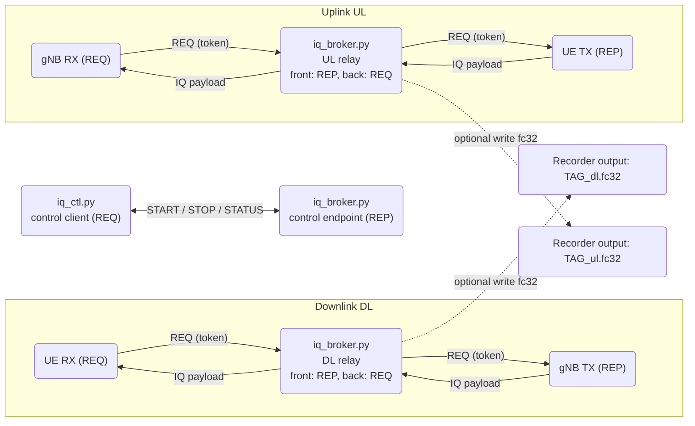

# 5G Standalone Infrastructure

This repository is meant to provide a Dockerized multi-container solution for the deployment of a 5G Standalone (SA) private network, for testing and educational purposes.
It is based on [srsRAN project](https://github.com/srsran/srsran_project) for the Radio Access Network (RAN) and [Open5GS](https://github.com/open5gs/open5gs) for the Core Network, with custom configurations and fixes.

## Quick Start

This folder contains multiple docker compose configurations for different deployment scenarios:

| Compose File | Services | Purpose |
|--------------|----------|---------|
| `docker-compose.yml` | `5gc`, `gnb` | Complete gNB + Core deployment |
| `docker-compose.split.yml` | `cu-cp`, `cu-up`, `du` | CU/DU split architecture that replace the gNB |
| `docker-compose.ui.yml` | `telegraf`, `influxdb`, `grafana` | Monitoring and metrics visualization |

### Running the stack: 5GCN + gNB + monitoring

To launch the solution with Core Network + gNB, just run the `docker-compose.yml` file, which will start both the Open5GS 5GCN and srsRAN gNB.

This can also be combined with the monitoring stack, composed by InfluxDB, Telegraf and Grafana services, by adding the `docker-compose.ui.yml` file.

Here are both commands (add `--build` to force a new build of the containers):

```sh
# Run gNB + core
docker compose -f docker-compose.yml up -d

# Run gNB + core with monitoring stack
docker compose -f docker-compose.yml -f docker-compose.ui.yml up -d
```

## Service Management

### See logs

To see services' output, run:

```sh
docker compose logs [OPTIONS] [SERVICE...]
```

For instance, add **`gnb`** to can see logs of the srsRAN gNB, or **`5gc`** for the core network. Append `--follow` to follow logs in real-time.

### Tear down the deployment

To stop any deployment:

```sh
docker compose -f docker-compose.yml -f docker-compose.ui.yml down --remove-orphans

# Additionally, --volumes to remove also all internal data except the setup:
docker compose -f docker-compose.yml -f docker-compose.ui.yml down --remove-orphans --volumes
```

## Configuration

### Open5GS Container

Open5GS provides the sample configuration [open5gs-5gc.yml](open5gs/open5gs-5gc.yml), which is NOT a Standalone config. However, it is possible to select a custom configuration to use by setting the env variable `OPEN_5GS_CONFIG_FILE` in [open5gs.env](open5gs/open5gs.env).

The config here provided and set as default, i.e., [open5gs_SA.yml](configs/open5gs_SA.yml), is an actual Standalone configuration (disabled: MME, HSS, PCRF, SGWC, SWGU) that can be used as is. Refer to [docs](https://open5gs.org/open5gs/docs/guide/01-quickstart/) for more details.

Moreover, the env file itself can also be replaced by a custom one by setting the `OPEN_5GS_ENV_FILE` variable like in:

```sh
OPEN_5GS_ENV_FILE=/my/open5gs.env docker compose -f docker-compose.yml up 5gc
```

The following parameters are available for customization:

- **`MONGODB_IP`** (default: `127.0.0.1`) - This is the IP of the mongodb to use. 127.0.0.1 is the mongodb that runs inside this container.
- **`SUBSCRIBER_DB`** - This adds subscriber data for a single or multiple users to the Open5GS mongodb. It contains either:
  - Comma separated string with information to define a subscriber (e.g., `"001010123456780,00112233445566778899aabbccddeeff,opc,63bfa50ee6523365ff14c1f45f88737d,8000,10.45.0.2"`), or
  - `subscriber_db.csv`, CSV file that contains as many entries as the subscribers to add to open5gs mongodb. It must be stored in `srsgnb/open5gs/`.
- **`OPEN5GS_IP`** - This must be set to the IP of the container (here: `10.53.1.2`).
- **`UE_IP_BASE`** - Defines the IP base used for connected UEs (here: `10.45.0`).
- **`DEBUG`** (default: `false`) - Set this to `true` to run Open5GS in debug mode.

For better modularity and faster deployment, the following env variables have been implemented:

- **`UE_APN`** (default: `srsapn`) - APN/DNN used for data sessions of the new subscribers created by `add_users.py`.
- **`UE_SESSION_MODE`** (default: `3`) - Session mode for the data sessions of new subscribers. Possible values:
  - `1`: IPV4
  - `2`: IPV6
  - `3`: IPV4V6

The CSV file must have the following format:

```csv
# Kept in the following format: "Name,IMSI,Key,OP_Type,OP/OPc,AMF,QCI,IP_alloc"

# Name:         Human readable name to help distinguish UE's. Ignored by the HSS
# IMSI:         UE's IMSI value
# Key:          UE's key, where other keys are derived from. Stored in hexadecimal
# OP_Type:      Operator's code type, either OP or OPc
# OP/OPc:       Operator Code/Cyphered Operator Code, stored in hexadecimal
# AMF:          Authentication management field, stored in hexadecimal
# QCI:          QoS Class Identifier for the UE's default bearer.
# IP_alloc:     IP allocation strategy for the SPGW.
#               With 'dynamic' the SPGW will automatically allocate IPs
#               With a valid IPv4 (e.g. '10.45.0.2') the UE will have a statically assigned IP.

# Note: Lines starting by '#' are ignored and will be overwritten:
ue01,001010123456789,0011...eff,opc,63bf...37d,8000,9,10.45.0.2
```

---

The Open5GS WebUI to manually add/change UEs to the mongodb can be accessed at [localhost:9999](http://localhost:9999), using the default credentials:

- username: `admin`
- password: `1423`

### srsRAN gNB Container

Default docker compose uses [gnb_rf_b200_tdd_n78_20mhz.yml](configs/reference/gnb_rf_b200_tdd_n78_20mhz.yml) config file. To choose a different one, set the **`GNB_CONFIG_PATH`** variable in:

- the existing env-file `.env`,
- in the shell, or
- in the `docker compose up` command line.

To use this container with srsgnb, the `addr` option under `amf` section in gnb configuration must be set in **`OPEN5GS_IP`** (here: `10.53.1.2`).
It could also be required to modify `bind_addr` option under `amf` section in gnb configuration to the local ethernet/wifi IP address for the host or container where gnb is running, not a localhost IP (here: `10.53.1.3`).

To ping a connected UE setup the necessary route to the `UE_IP_BASE` + ".0/24" (here: `10.45.0`) via the `OPEN5GS_IP` using:

```sh
sudo ip ro add 10.45.0.0/16 via 10.53.1.2
```

---

Apart from the ones provided by srsRAN ([original configs](configs/original)), two configurations are provided, both using PLMN (*MCC+MNC*) `00101` and TAC `7`, and based on USRP X410 hardware:

- [gnb_tdd.yml](configs/gnb_tdd.yml): TDD mode, band n78, 20MHz bandwidth, SCS 30kHz.
- [gnb_fdd.yml](configs/gnb_fdd.yml): FDD mode, band n3, 20MHz bandwidth, SCS 15kHz.

For details, refer to the official configuration [guide](https://docs.srsran.com/projects/project/en/latest/user_manuals/source/config_ref.html) by srsRAN.

### Metric UI: Enabling metrics reporting in the gNB

To be able to see gNB's metrics in the monitoring UI (Grafana + InfluxDB + Telegraf), it's required to enable metrics reporting in the gNB config.

To achieve this, ensure the gNB configuration includes:

```yml
metrics:
  autostart_stdout_metrics: true
  enable_json: true
remote_control:
  bind_addr: 0.0.0.0
  enabled: true
```

Change the environment variables define in `.env` that are used to setup and deploy the stack.

The Grafana dashboard can be reached at [localhost:3300](http://localhost:3300), with more detailed dashboards at `Home > Dashboards`. By default, it will be in view mode without needing to log in. In case you want to modify anything, log in using following credentials:

- username: `admin`
- password: `admin`

After the fist login, it will ask to change the password for a new one, but it can be skipped.

> [!WARNING]
> **They do NOT support variable substitution**, so if default values in `.env` file are changed, you would need to reach `grafana/dashboards/` and manually search and replace values such as influxdb uid or bucket in every `.json` file.

## ZMQ-based Radio Interface

This repository includes a "virtual" radio interface based on ZeroMQ (ZMQ) to simulate the connection between gNB and UE(s) without a real RF front-end, whose concept is inspired to this [example](https://docs.srsran.com/projects/project/en/latest/tutorials/source/srsUE/source/index.html) but revised for better flexibility. The architecture is composed of:

- **gNB (srsRAN)**: ZMQ radio endpoint on the network side.
- **UE (srsUE)**: ZMQ radio endpoint on the terminal side.
- **ZMQ broker** (`zmq/broker/iq_broker.py`): a relay in the middle that forwards IQ samples (tapping) in both directions and can optionally record them to file.
- **Control client** (`zmq/broker/iq_ctl.py`): a controller to manage the recording (start/stop/status).

### Architecture scheme

Here it is an essential scheme of the architecture:



### Recording (tapping) IQ Samples

For a more dynamic recording of IQ samples, we implemented [iq_ctl.py](zmq/broker/iq_ctl.py), a control script which allows to start/stop recording on-demand via a ZMQ control endpoint exposed by the broker.

To use the recorder we can simply run:

```sh
# From within the broker container:
python3 ./zmq/broker/iq_ctl.py --ctl tcp://zmq_broker:5555 <ACTION>

# Or, from the host:
docker exec -it zmq_broker python3 /app/iq_ctl.py --ctl tcp://127.0.0.1:5555 <ACTION>
```

where `<ACTION>` can be:

- `START`: starts recording IQ samples. By default, it will identify the recording with an instantaneous timestamp tag, but a custom one can be provided with `--tag <TAG>`.
- `STOP`: stops the ongoing recording.
- `STATUS`: queries the current status of the broker (recording or idle).

Once stopped, `iq_broker.py` will write the recordings in `--out-dir` (default: **`/iq`** in the broker container), which is mapped to a host folder (e.g., `captures/`) for offline analysis.

> [!WARNING]
> Be aware that files grow very quickly in size (1 minute = ~10GB per direction).

### Stack ZMQ (compose/config)

The full setup ready-to-use (Open5GS + gNB + broker/recorder + UE + monitoring) can be found in the [`zmq/`](zmq/) folder, which contains:

- `docker-compose.yml`: to launch Core Network + gNB + UE(s) + ZMQ broker.
- `docker-compose.ui.yml`: monitoring stack (same as the main one).
- `gnb/gnb_fdd_zmq.yml`: gNB configuration file using ZMQ interface (FDD mode).
- `srsue/srsue_zmq.conf`: srsUE configuration file using ZMQ interface.
- `broker/iq_broker.py`: relay + recorder.
- `broker/iq_ctl.py`: control client.

> [!WARNING]
> This architecture is that only a single UE can be connected at a time, due to the REQ/REP handshake mechanism used for data plane.

> [!WARNING]
> Moreover, the nature of ZMQ implies that when either gNB or UE is stopped/restarted, the other one must be restarted as well.
